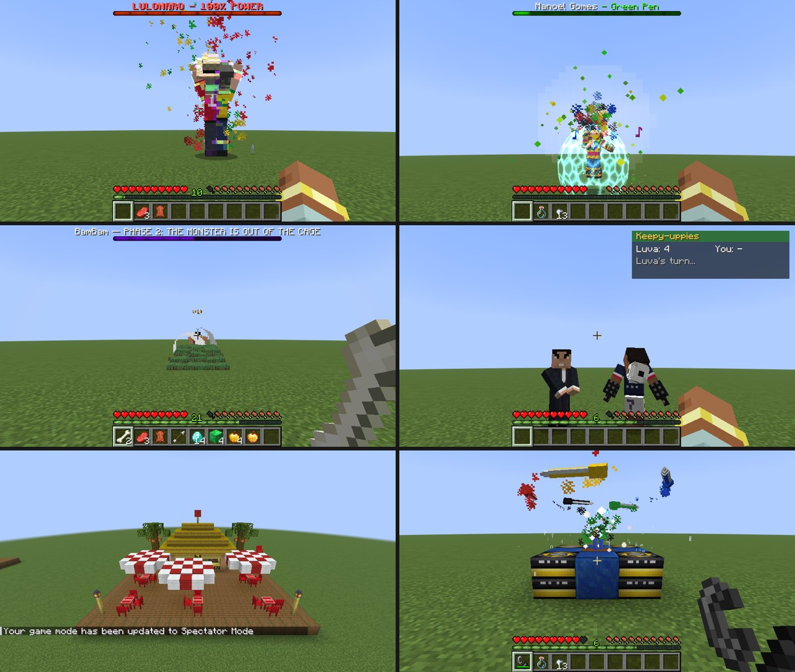
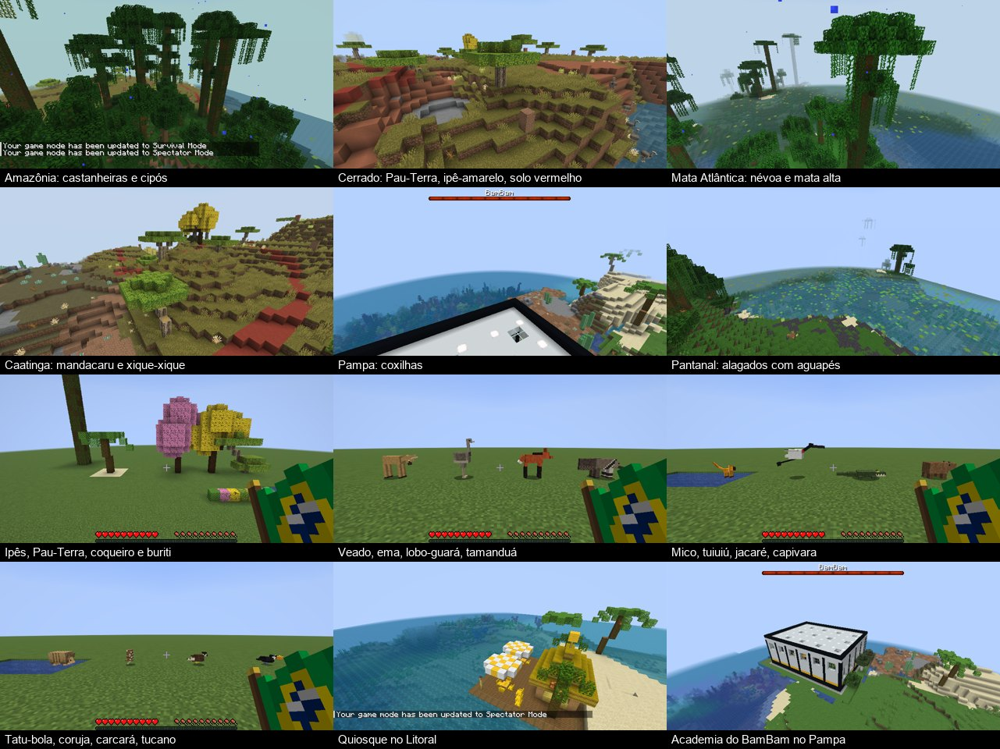
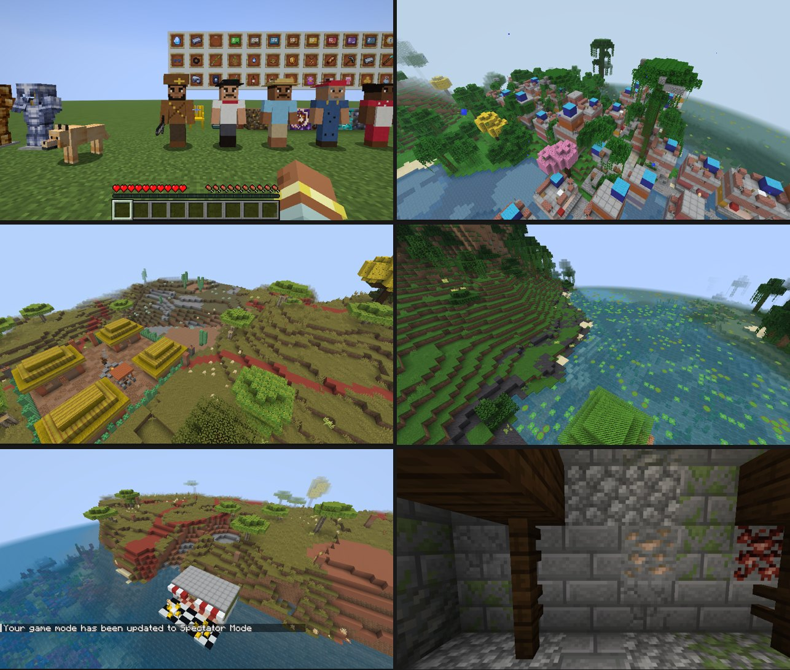

# Irineu, Jailson & BamBam — memes BR no Minecraft

> [!NOTE]
> **Projeto 100% vibecodado com o [Claude Code](https://www.anthropic.com/claude-code).** Todo o código Java, os geradores Python, as texturas, os modelos e animações, os sons sintetizados, as estruturas, os testes automáticos e esta documentação foram escritos pelo Claude Code (Anthropic), a partir das ideias e pedidos do Mazzega. O Mazzega idealizou o mod, testou no jogo e decidiu o que mudar a cada versão; nenhuma linha foi escrita à mão.

Mod para **Minecraft 26.3 / Fabric** (Loader 0.19.5, Fabric API 0.161.0+26.3, Java 25+).

**Precisa do [GeckoLib](https://www.curseforge.com/minecraft/mc-mods/geckolib) 5.5.7+ para Fabric 26.3** na pasta `mods` (é ele que anima o BamBam e o Manoel Gomes).

Adiciona a dimensão **Brasil** (com Amazônia, Cerrado, Mata Atlântica, Caatinga, Pampa e Pantanal, plantas e bichos brasileiros) e, morando nela, o **Irineu** e o **Jailson Mendes** como mobs neutros, o **BamBam** (com fase 2 e a **academia** dele) e o **Manoel Gomes** (com 3 fases) como bosses, o **Luva de Pedreiro** com o empresário **Allan Jesus** (desafios valendo prêmio), o **chefão final Lula e Bolsonaro** (4 fases, com a fusão no Lulonaro), o item **Suco de Laranja** e **quiosques de praia** com mesas e cadeiras de plástico. Desde a versão 3: a **economia do Real** (notas, Pix na maquininha, inflação semanal e a nota de 3 reais), **minérios brasileiros** (nióbio, turmalina Paraíba, hematita de Carajás, ágata e ametista, topázio imperial e o cascalho de aluvião) com o que se faz com eles, **itens da cultura popular** (Havaiana de Pau, Bambu do Silvio, gambiarra, óculos Juliet, filtro de barro, comidas) e **estruturas** com comerciantes (favela, buteco, vila de cangaceiros, estância gaúcha, palafitas e as ruínas de Carajás).

## Instalação
1. Instale o **Fabric Loader 0.19.5+** para o **Minecraft 26.3** (Java 25).
2. Coloque na pasta `mods`:
   - o jar do mod (`irineu-<versão>+26.3.jar`, na aba **Releases** do GitHub);
   - a [Fabric API](https://modrinth.com/mod/fabric-api) para 26.3;
   - o [GeckoLib](https://www.curseforge.com/minecraft/mc-mods/geckolib) 5.5.7+ para Fabric 26.3.
3. Abra o jogo. O conteúdo novo fica nas abas do criativo (a aba **Brasil** reúne economia, minérios e cultura) e na dimensão Brasil (veja abaixo como entrar).

Funciona em mundo de um jogador e em servidor (o mod precisa estar no servidor e em quem conecta).





## A dimensão Brasil
Tudo o que o mod tem acontece lá: o Irineu e o Jailson nascem nos biomas do Brasil, os quiosques ficam no Litoral e nas estradas do Pampa e do Cerrado, a academia do BamBam no Cerrado, no Pampa e na Mata Atlântica, e o Luva de Pedreiro só aparece para quem está no Brasil. No Overworld não nasce mais nada do mod (os ovos geradores, a urna e o totem do Manoel funcionam em qualquer lugar).

- **Dimensão** `brasil_mod:brasil`: terreno de superfície como o do Overworld (com menos mar), dia e noite, céu limpo.
- **Portal:** faça uma moldura como a do Nether (de 4x5 até 23x23) com **terracota amarela** e/ou **terracota verde** e use a **Bandeira Nacional** dentro dela. A bandeira não gasta; receita: 3 lãs verdes em cima, lã amarela, lã azul e lã amarela no meio e um graveto embaixo à esquerda. Fique no portal verde-amarelo e azul uns segundos (como no Nether) e você chega no Brasil, **sempre na superfície e em chão firme**: do outro lado ele usa o portal mais perto ou constrói um de volta em cima do terreno (nunca dentro do morro). Prefere um lugar plano; num barranco, completa o chão com terracota, e em cima d'água faz uma plataforma. Um portal que tenha ficado enterrado no Brasil (versões antigas podiam fazer isso) é ignorado na chegada e um novo é feito na superfície. O portal do Brasil leva de volta para o Overworld.

| Bioma | Terreno e clima | Plantas | Bichos |
|---|---|---|---|
| **Amazônia** | Planícies de mata fechada cortadas por rios; água verde-turva; quente e úmido, com garoa sempre caindo e névoa | Árvores da selva, **castanheiras** gigantes (tronco altíssimo e copa em guarda-chuva), cipós, **vitórias-régias** nos rios, **orquídeas**, melancias | Papagaios e araras, **tucanos**, jaguatiricas, **botos-cor-de-rosa** nos rios, peixes tropicais |
| **Cerrado** | Savana aberta com platôs, grama amarelada e solo vermelho (barro e terracota); seco | **Pau-Terra** (madeira nova: tronco retorcido de casca clara e folhas floridas), **ipê-amarelo**, arbustos secos, capim alto, **capim-navalha** e **cupinzeiros** | **Tamanduás-bandeira**, **lobos-guarás**, **emas**, tatus, coelhos |
| **Mata Atlântica** | Serras íngremes com paredões de pedra, vales úmidos e muitas **cachoeiras**; verde vivo, névoa e garoa | Árvores altas com cipós, **ipês amarelos e rosas** (soltam pétalas), **bromélias**, orquídeas, samambaias grandes e bambus | **Micos-leões-dourados**, tucanos, papagaios, jaguatiricas |
| **Caatinga** | Terreno pedregoso com **lajedos** de pedra, terra seca cinza e marrom; **nunca chove** e **não tem água corrente** (os rios viram leitos secos) | **Mandacarus** (cactos de braços que espetam), **xique-xique**, arbustos espinhentos sem folhas | **Tatus-bola**, cabras, **carcarás** (ave de rapina) |
| **Pampa** | Coxilhas: colinas verdes e suaves sem fim, horizonte aberto | Grama rasteira e flores, quase sem árvores (raros **capões**) | Cavalos, ovelhas, vacas, **corujas-buraqueiras**, **veados-campeiros** |
| **Pantanal** | Baixadas **alagadas** (metade do chão vira lagoas rasas com ilhas de terra e beiras de lama), água límpida | **Buritis** (palmeiras), **aguapés**, vitórias-régias, **juncos**, capim-navalha | **Capivaras**, **jacarés**, **tuiuiús**, sapos |
| Litoral e Oceano | Praias com **coqueiros** (com coco) e os quiosques; mar tropical azul-turquesa | | Tartarugas; golfinhos e peixes no mar |

### Plantas e madeiras novas
| Bloco | O que é |
|---|---|
| **Tronco, Tábuas e Folhas de Pau-Terra** | A madeira do Cerrado (4 tábuas por tronco, servem como qualquer tábua). As folhas têm florzinhas amarelas que caem |
| **Flores de Ipê-Amarelo / Ipê-Rosa** | A copa toda florida dos ipês, soltando pétalas |
| **Mudas de Pau-Terra, Ipê-Amarelo e Ipê-Rosa** | Caem das folhas e flores dessas árvores (como as mudas do jogo: 5%, mais com Fortuna). Plante em terra ou grama e espere, ou use farinha de osso, e cresce a mesma árvore dos biomas. Vão no vaso de flor, compostam e servem de combustível |
| **Folhas de Palmeira** | Dos buritis e coqueiros |
| **Orquídea** e **Bromélia** | Flores (viram corante roxo e vermelho) |
| **Junco** | Hastes altas na beira d'água |
| **Capim-Navalha** | Prende e **corta** quem passa no meio (como o arbusto de frutas doces) |
| **Xique-Xique** e **Mandacaru** | Cactos da Caatinga: **espetam** ao encostar. O mandacaru nasce com braços |
| **Vitória-Régia** e **Aguapé** | Plantas que boiam na água (como a vitória-régia) |

### Bichos do Brasil
| Bicho | Onde | Comportamento | Come (para criar) |
|---|---|---|---|
| **Tamanduá-Bandeira** | Cerrado | Anda devagar fuçando o chão; se apanha, **fica de pé e se defende com as garras** | Frutas doces |
| **Lobo-Guará** | Cerrado | Pernas pretas compridas; **foge de gente**, caça coelhos e galinhas e **uiva à noite** | Maçã, frutas doces |
| **Ema** | Cerrado | Corre muito quando se assusta e **bota ovos** | Sementes |
| **Mico-Leão-Dourado** | Mata Atlântica | Rápido e saltitante; **sobe em troncos e paredes** | Melancia, frutas doces, cacau |
| **Tucano** | Mata Atlântica e Amazônia | **Voa** de árvore em árvore com o bicão laranja | Melancia, frutas |
| **Carcará** | Caatinga | Ave de rapina: **voa e caça** coelhos e galinhas; só ataca o jogador se apanhar | Coelho e frango crus |
| **Coruja-Buraqueira** | Pampa | Vive no chão, **gira a cabeça** e balança o corpo; assustada, voa baixinho | Olho de aranha |
| **Veado-Campeiro** | Pampa | Pasta e, ao ver gente, **levanta a cabeça e dispara** (a não ser que você traga trigo) | Trigo |
| **Capivara** | Pantanal | A mais tranquila: anda em bando e **nada** | Cana, melancia |
| **Jacaré** | Pantanal | Toma sol de boca aberta e **nada mergulhado**; não ataca à toa, mas **provocado é perigoso, ainda mais na água** (mais rápido e morde mais forte) | Peixe cru |
| **Tuiuiú** | Pantanal | Cegonha enorme que anda na água rasa, **bate o bico** e, assustada, **levanta voo** | Peixe |
| **Tatu-Bola** | Caatinga | Se fecha numa **bola** quando se sente ameaçado | Olho de aranha |
| **Boto-Cor-de-Rosa** | Rios da Amazônia | O golfinho de rio, rosado, que nada com você | — |

Cada um tem modelo e animações próprios (GeckoLib; o tatu-bola e o boto usam o tatu e o golfinho do jogo com a pele deles), sons, ovo gerador (aba Ovos Geradores) e drops (couro, penas, carne).

## Economia do Real (versão 3)
Tudo fica na aba **Brasil** do modo criativo.

### Notas e moeda
| Item | Valor | De onde vem |
|---|---|---|
| **Moeda de 1 Real** | R$ 1 | Monstros mortos no Brasil (10% de chance, 1 a 3), a bateia, baús |
| **Nota de 2** (tartaruga) | R$ 2 | Tartarugas no Brasil |
| **Nota de 5** (garça) | R$ 5 | Tuiuiús (o pernalta do Pantanal faz as vezes da garça) |
| **Nota de 10** (arara) | R$ 10 | Papagaios/araras |
| **Nota de 20** (mico-leão) | R$ 20 | Micos-leões-dourados |
| **Nota de 50** (onça) | R$ 50 | Jaguatiricas |
| **Nota de 100** (garoupa) | R$ 100 | Bacalhaus e peixes tropicais (os peixes de mar) |
| **Nota de 200** (lobo-guará) | R$ 200 | Lobos-guarás (a mais rara: 2,5%) |
| **Nota de 3 Reais** | falsa | Baús da favela e do buteco, ou papel + corante verde |

- Cada bicho do Brasil morto por um jogador às vezes deixa a nota dele (de 2,5% a 6%). O **Amuleto da Sorte** dobra a chance.
- **Câmbio na mesa de trabalho** (sem forma):
  - Para subir de nota: 2 moedas = nota de 2; 5 moedas = nota de 5; 5 notas de 2 = 10; 2 de 5 = 10; 2 de 10 = 20; 5 de 10 = 50; 5 de 20 = 100; 2 de 50 = 100; 2 de 100 = 200.
  - Para trocar: cada nota volta nas menores (200 = 2x100, 100 = 2x50, 50 = 5x10, 20 = 2x10, 10 = 2x5, 5 = 5 moedas, 2 = 2 moedas).

### Maquininha Pix
- Bloco (receita: ferro, painel de vidro verde-limão, redstone e botão de pedra). Clique nela, ou use o item no ar (a maquininha funciona na mão também).
- Na tela:
  - Ponha as notas na casa e aperte **Depositar**: elas viram **saldo Pix**, guardado no jogador (não some quando ele morre).
  - Os botões de **1 a 200** sacam uma nota de cada valor.
  - O visor mostra o saldo.
- Toca o **bip-bip** quando a transação passa e um **bzzz** quando é recusada. Nota de 3 a maquininha recusa na hora.
- **Pagar no Pix:** nos comerciantes do mod, ao escolher uma oferta, as notas do inventário vão para o pagamento como sempre. O que faltar sai do saldo Pix (com o bip). Se fechar sem comprar, as notas vão para o inventário.

### Inflação
- A cada **7 dias do jogo** os preços de todos os comerciantes do mod mudam, de **-15%** ("baixa do dólar") a **+40%** ("alta da inflação").
- Quanto mais dinheiro parado no Pix de todo mundo, mais ela tende a subir.
- O aviso sai numa linha no chat, uma vez por semana (é a única mensagem do mod no chat).
- Comandos:
  - `/inflacao`: mostra a inflação atual.
  - `/inflacao definir <de -15 a 40>` e `/inflacao sortear`: só para operador.

### Nota de 3 reais
Use com o **Dono do Buteco** ou os **comerciantes da favela**:
- **70% de chance:** ele recusa e solta um "Quer me passar a perna?!" (acima da barra de itens, não no chat).
  - Os vira-latas caramelo em volta partem para cima (e aparecem mais se tiver poucos).
  - Ele e os comerciantes por perto não negociam com o caloteiro por um dia.
- **30% de chance:** passa batido e abre a venda com **tudo a 25% do preço**.

### Comerciantes
| Comerciante | Onde | Vende | Compra |
|---|---|---|---|
| **Dono do Buteco** | Buteco (e o buteco da favela) | Coxinha, pão de queijo curado, cafezinho, cerveja gelada, copão de Guaraná Jesus, Corote Místico, marmita de feijoada | Garrafas vazias (o casco) |
| **Camelô** | Praça e banca da favela | Óculos Juliet, Havaiana de Pau, gambiarra, Bambu do Silvio, maquininha, fogos | — |
| **Dona da Mercearia** | Favela | Marmita, pão de queijo, guaraná, pão, filtro de barro | Trigo, cenoura, batata, cana |
| **Seu do Ferro-Velho** | Favela | Gambiarra, bateia, pepitas de ferro | Ferro, cobre, ouro, aço pesado |
| **Pescador** | Palafitas | Vara, bateia, peixe frito, Lágrima da Iara | Bacalhau, salmão, peixe tropical, baiacu |
| **Gaúcho** | Estância | Chimarrão, churrasco, sela, laço, couro | Trigo, carne crua |

## Minérios do Brasil (versão 3)
| Minério | Onde | Dá | Para quê |
|---|---|---|---|
| **Nióbio** | Fundo do **Cerrado** (abaixo de y -20) | Nióbio bruto, que funde em **lingote** | **Molde de aprimoramento de nióbio** (diamantes + lingote + fragmento de netherite; duplica como o de netherite). Na **mesa de ferraria**: peça de netherite + molde + lingote = peça de **nióbio** (3x a durabilidade da netherite, mesma proteção; o **peitoral** dá resistência total a empurrão) |
| **Turmalina Paraíba** | **Caatinga** (brilha no escuro) | A gema azul-neon | **Cajado Relâmpago**: a faísca pula em cadeia por até **4 alvos** (7, 6, 5 e 4 de dano). **Só no tempo seco**: na chuva a turmalina chia e apaga |
| **Hematita de Carajás** | **Amazônia** (farta) | Hematita bruta, que funde (melhor no alto-forno) em **aço pesado** | **Picareta Industrial** (quase diamante, mais durável): **agachado minera 3x3** na face que você está minerando |
| **Ágata e Ametista** | **Geodos** no subsolo do **Pampa** | Ágata (e às vezes ametista) | **Amuleto da Sorte**: basta estar no inventário. Metade das colheitas maduras saem dobradas e as notas dos bichos caem com o dobro da chance |
| **Topázio Imperial** | **Mata Atlântica** (até nas serras) | O topázio | **Armadura Imperial** (entre ferro e diamante, muito encantável): cada peça dá 25% de chance de **cegar** quem bate de perto (o conjunto completo cega sempre) |
| **Cascalho de Aluvião** | Fundo dos rios e de algumas lagoas do **Pantanal** | O próprio cascalho | **Bateia de madeira** (2 gravetos + tigela): clique no cascalho para **peneirar**. Ele vira areia lavada e sai pepita de ouro, moeda de 1 real, sílex, ouro bruto ou, rara, a **Lágrima da Iara** (golfinho + respirar debaixo d'água por 3 minutos) |

## Cultura popular (versão 3)
| Item | O que faz |
|---|---|
| **Havaiana de Pau** | Arma (5 de dano). **Clique direito arremessa como bumerangue**: vai reto, acerta quem estiver no caminho e **volta para a mão**. **Pelas costas** (na mão ou arremessada) é **crítico** (+50%) e **Repulsão IV** |
| **Bambu do Silvio** | Clique direito: bate no chão e solta uma **onda de choque com som de mola**. Tudo que está no chão num raio de **5 blocos** é jogado para o alto (~4 blocos) |
| **Cadeira de Bar Amarela** | A cadeira de plástico amarela do bar. **Sentado nela a vida volta devagar** (meio coração a cada 2s). Na mão (de preferência a secundária) vira um **escudo inquebrável que segura o fogo** |
| **Filtro de Barro** | Bloco. Despeje um **balde d'água** (rende 3 frascos) e encha **frascos** com **Água Filtrada**: **Imunidade** por 3 minutos (sem veneno e sem decomposição) |
| **Gambiarra Universal** | Fita isolante e arame: conserta **metade da durabilidade** do item na **outra mão**, sem bigorna. Gasta uma |
| **Óculos Juliet** | Vai na cabeça: **visão noturna** e os **endermen não se irritam** com o seu olhar |

### Comidas e bebidas
| Comida | Efeito | Penalidade |
|---|---|---|
| **Pão de Queijo Curado** | Forra bem e dá Absorção (1 min) | Metade das vezes dá sede (Fome por 10s) |
| **Copão de Guaraná Jesus** | Velocidade II e Super Pulo (45s) | A ressaca do açúcar (Fome II por 15s) |
| **Marmita de Feijoada** | Enche a fome inteira, Resistência (2 min) e Regeneração | A moleza: Lentidão II (40s) e Cansaço; demora mais para comer |
| **Corote Místico** | Força e Resistência ao Fogo (45s) | Náusea e **teleporta você para algum lugar perto** |
| **Coxinha** | Comida boa (6) | — |
| **Cafezinho** | Pressa (1 min) e Velocidade (30s) | — |
| **Cerveja Gelada** | Regeneração (10s) | Náusea (8s) |
| **Chimarrão** | Regeneração e Resistência (1 min) | — |

## Estruturas do Brasil (versão 3)
| Estrutura | Onde | O que tem |
|---|---|---|
| **Favela** | Encostas da **Mata Atlântica** | Montada em peças, como as vilas do jogo: uma praça com a caixa d'água grande, o camelô e os vira-latas, e **becos que seguem o terreno**. Em volta deles, **casas empilhadas** de tijolo e reboco colorido, com laje, vergalhão aparecendo e **caixa d'água azul**; às vezes um **puxadinho** em cima da laje. Tem também as **biroscas** (camelô, mercearia, ferro-velho) e um buteco. Baús com notas, comida e, às vezes, a nota de 3 |
| **Buteco** | Comum em quase todo o Brasil | Piso de lajota, calçada de pedra portuguesa, toldo listrado, balcão com a **maquininha**, geladeira, as mesas de plástico com as **cadeiras amarelas** na calçada e o **Dono do Buteco** |
| **Vila de Cangaceiros** | **Caatinga** | Paliçada de **mandacaru**, casas de taipa com telhado de palha, poço seco, fogueira no terreiro e **cangaceiros** armados com peixeira. São neutros: mexeu com um, o bando inteiro vem atrás |
| **Estância Gaúcha** | **Pampa** | O **galpão** com o **fogo de chão** no meio e bancos em volta, chimarrão no baú, a **mangueira** (curral) com cavalos e o cocho d'água, e o **gaúcho** |
| **Palafitas** | Rios e lagos da **Amazônia** e do **Pantanal** (só nascem em cima d'água) | Cabanas de tábua com telhado de folha de palmeira sobre esteios, passarelas, a rede e os **pescadores** |
| **Ruínas de Carajás** | Debaixo da **Amazônia** | A boca da mina (com alçapão) na superfície e a escada até as galerias. Corredores escorados, cheios de veios de **ferro e hematita**, salas de minério, **salas com spawner** (zumbi, esqueleto ou aranha da caverna) e a sala do tesouro (aço pesado, notas de 100 e 200, a picareta industrial) |

### Vira-lata caramelo
É uma variante nova de lobo (pelo caramelo) que aparece na favela e no buteco. Doma e cuida como qualquer lobo.

## Irineu
Mob neutro. Ele anda por aí soltando as falas icônicas e só briga se apanhar.

## Habilidades
| Habilidade | Como funciona |
|---|---|
| **"Você não sabe? Nem eu!"** | Ao ser atacado, 50% de chance (recarga de 10s) de deixar o agressor com Náusea (8s) e Cegueira (3s). |
| **"Nem eu!" (sumiço)** | Com menos de 40% de vida, some numa nuvem de fumaça, reaparece até 12 blocos longe, ganha Velocidade II e Regeneração e para de brigar (recarga de 20s). |
| **"Irineu!" (presente)** | Clique com a mão vazia: ele joga um presente aleatório (pão, biscoito, maçã, esmeralda, ferro, cenoura dourada ou, raramente, diamante). Recarga de 5 min por Irineu. |
| **Tapão** | 4 de dano com bastante repulsão. Bateu em um Irineu, todos os Irineus por perto vêm atrás de você. |
| **Pão** | Segue quem estiver segurando pão. Dar pão para ele recupera 3 corações. |

- Aparece naturalmente (raro) no **Brasil**: Pampa, Cerrado e Litoral.
- Ovo gerador na aba **Ovos Geradores** do criativo, ou `/summon irineu:irineu`.
- Ao morrer: 0–2 pães e chance de esmeralda.

## Jailson Mendes
Mob neutro e meio preguiçoso: anda devagar e fala as frases dele de vez em quando.

| Habilidade | Como funciona |
|---|---|
| **Suco de Laranja** | Dê um suco para ele: "Ai, que delícia, cara!". Ele se cura e **aparece mais um Jailson** do lado. Recarga de 2 min por Jailson, e não nasce outro se já houver 16 Jailsons num raio de 32 blocos. |
| **"É essa peça que você queria?"** | Clique com a mão vazia: ele joga uma peça aleatória (pepita de ferro, ferro, cobre, redstone, pepita de ouro, pistão ou, raramente, carrinho de mina). Recarga de 5 min. |
| **"Não quero trabalhar"** | Tente entregar uma picareta, machado, pá ou enxada e ele recusa. |
| **Pai de família** | Bateu em um Jailson, a família inteira vem atrás de você gritando "Vai! Vai! Vai!". |
| **Suco na mão** | Ele segue quem estiver segurando Suco de Laranja. |

- Aparece naturalmente (raro) no **Brasil**: Mata Atlântica, Pampa e Litoral.
- Ovo gerador na aba **Ovos Geradores**, ou `/summon irineu:jailson`.
- Ao morrer: pepitas de ferro e chance de Suco de Laranja.

## BamBam (boss)
"Tá saindo da jaula o monstro!" Tem **modelo próprio bombado** (trapézio, peitoral, tanquinho, deltoides e bíceps), 2,6 blocos de altura, **250 de vida**, armadura e **barra de boss** vermelha.

| Habilidade | Como funciona |
|---|---|
| **Arremesso de árvore** | A cada ~8s ele larga o que está fazendo, vai até a **árvore natural mais próxima** (até 16 blocos), arranca do chão ("Vou derrubar todas essas árvores do Parque Ibirapuera!"), segura acima da cabeça por 1,5s mirando e **arremessa em cima do jogador**, mirando à frente de quem corre. O impacto dá 7 corações de dano em área (3 blocos), empurra e deixa a madeira espalhada no chão. |
| **BIRL!** | Quando tem alguém a até 6 blocos (ou 3+ criaturas em volta), ele para, faz **pose de duplo bíceps** carregando por 1s e grita **"BIRL!"**: uma onda de vento **empurra todos os mobs e jogadores num raio de 9 blocos** (quanto mais perto, mais longe voa: colado nele você voa ~16 blocos). Recarga de 15s. |
| **Soco** | Entre um arremesso e outro, puxa o braço e solta um **cruzado** (alternando direita e esquerda) de 7 corações, com muita repulsão e jogando o alvo para cima. O soco sai 1/4 de segundo depois de puxar o braço: dá para desviar. |

- **Só arranca árvores naturais**: precisa ter folhas que não foram colocadas por jogador, então casas de madeira ficam a salvo. Se a regra `mob_griefing` estiver desligada, ele arremessa a árvore sem tirá-la do mundo (e sem dropar madeira).
- Mora na **Academia do BamBam** (veja abaixo). Também dá para chamar com o **ovo gerador** (aba Ovos Geradores) ou `/summon irineu:bambam`. Some no Pacífico, como os outros bosses.
- Ao morrer: **4 Anilhas do BamBam** (o material do [totem do Manoel Gomes](#totem-do-manoel-gomes); +1 com Saque), maçã dourada, esmeraldas, ferro, mudas de carvalho e 100 de XP.

### Fase 2: "o monstro saiu da jaula"
Nenhum golpe tira mais que a metade da vida dele de uma vez: com **125 de vida** ele sempre para, grita "Tá saindo da jaula o monstro!" tremendo de raiva (3s, **invencível**, olhos ficam vermelhos) e **explode**: todo mundo num raio de 12 blocos toma até 4 corações e **voa ~20 blocos**. A partir daí:

- Barra de boss **roxa**, olhos vermelhos brilhando e bufando fumaça.
- **25% mais rápido**, soco 2 corações mais forte, **socando quase o dobro de rápido** e às vezes com uma **marretada** de dois braços.
- Arremesso de árvore e BIRL com recarga menor (5s e 9s), e três golpes novos:

| Golpe | Como funciona |
|---|---|
| **Terremoto** | Ergue os dois punhos ("Bora!"), bate no chão e solta uma **onda de choque** que corre pelo chão até o jogador (22 blocos, 3 de largura), levantando os blocos. Quem estiver no caminho toma 5 corações e é jogado para cima. Recarga de 7s. |
| **Pulo devastador** | Agacha ("Vem, porra!"), **salta até 11 blocos** (menos se tiver teto), segue o jogador no ar e **despenca em cima dele**. Um **círculo vermelho** no chão avisa onde vai cair: até 8 corações no centro, em área de 4,5 blocos. Recarga de 11s. |
| **Agarrão** | Avança de braços esticados, **agarra o jogador** e ergue acima da cabeça ("Ajuda o maluco que tá doente!"). Shift não adianta: ele segura de novo. Depois vira para a **parede mais próxima** (até 13 blocos) e **arremessa nela** (6 corações na batida), ou **para o alto** (~12 blocos) se não tiver parede. Recarga de 9s. |

### Falas do BamBam
Recortadas do vídeo de referência (`src/main/resources/assets/irineu/sounds/entity/bambam/`), com os palavrões originais:

| Evento | Fala |
|---|---|
| Ao aparecer | "Tá saindo da jaula o monstro, porra!" |
| Ao achar um alvo | "Hora do show, porra!" |
| Arrancando a árvore | "Vou derrubar todas essas árvores do Parque Ibirapuera, porra!" |
| Arremessando (árvore ou jogador) | "Vem, porra!" / "Bora!" |
| Fase 2 | "Tá saindo da jaula o monstro!" (mais grave) e "BIRL!" na explosão |
| Terremoto | "Bora!" / "Porra!" |
| Pulo devastador | "Vem, porra!" / "É verão o ano todo, vem monstro!" |
| Agarrão | "Ajuda o maluco que tá doente!" / "É 37 anos, caralho!" |
| Aura | "BIRL!" |
| Aleatório | "Aqui nós constrói fibra!", "Não é água com músculo!", "É 37 anos, caralho!", "É verão o ano todo, vem monstro!", "Ajuda o maluco que tá doente!" |
| Dano | "Porra!" / "Eita, porra!" |
| Morte | "Não vai dar, pai? Não vai dar essa porra?" / "Não vai dar não." |

## Animações (GeckoLib)
O BamBam, o Manoel Gomes (e os clones dele), o Luva de Pedreiro, o Allan Jesus e o chefão final usam modelos e animações do **GeckoLib** (formato do Blockbench), gerados por `tools/geckolib/build_models.py` em `assets/irineu/geckolib/`:

| Quem | Animações |
|---|---|
| **BamBam** | Respirando e abrindo os dorsais parado; andar de bombado (tronco balançando); cruzado de direita e de esquerda; marretada com os dois braços; BIRL (duplo bíceps tremendo e o grito com os punhos para o céu); erguendo e arremessando a árvore; transformação da fase 2 (agacha bufando, urra para o céu, junta força e abre os braços na explosão); terremoto (ergue os punhos e bate no chão agachado); pulo devastador (agacha jogando os braços para trás, encolhe no ar, aterrissagem de super-herói); agarrão (abre os braços, fecha, ergue o jogador e arremessa). Olhos vermelhos brilhando no escuro na fase 2. |
| **Manoel Gomes** | Parado, **canta com a caneta azul de microfone**, balançando no ritmo; anda com a caneta na boca; **arremesso** puxando a caneta para trás da cabeça (a caneta sai no meio do movimento); **invocação** erguendo a caneta como maestro (as canetas voadoras aparecem no auge, com notas musicais); fase 2: tira a caneta verde do bolso e ergue para o céu, arremessa a verde com a mão esquerda, chega do teleporte agachado de braços abertos; fase 3: flutua de braços abertos dentro do campo de força, ergue a mão para pegar a caneta colorida e desce em guarda, fica em guarda de lado com a caneta apontada, corre inclinado com a caneta para trás, **corte na horizontal** e **corte de cima para baixo**. Os clones usam as mesmas animações. |
| **Luva de Pedreiro** | Gingando parado; andando; **embaixadinhas** trocando de pé (o pé encosta na bola no mesmo tick do servidor); braços cruzados batendo o pé enquanto você joga; chute de passe; "**Receba!**" (corre, cai de joelhos no carrinho com os braços em V e os dedos das luvas apontando para o céu); balança o dedo dizendo "não". |
| **Allan Jesus** | Mãos juntas na frente, de empresário; apresentando com a mão aberta; aplaudindo; estendendo as mãos para pagar; braços cruzados balançando a cabeça. |
| **Lula** | Barriga respirando e o **joinha** com os dois polegares de vez em quando; andar dobrando joelho e cotovelo; chegada levantando de agachado com joinha; soco puxando o cotovelo; mastiga a picanha (o antebraço sobe e desce), vira a cana com a cabeça para trás e arremessa com as duas mãos; Estrela Vermelha com a base firme (joelho dobrado) e os punhos juntos tremendo cada vez mais até esticar os braços no disparo; braços em V para o céu batendo o pé para chamar os gados; investida agachando e disparando a correr; gira o tronco com as mãos abertas para o vórtice; de joelhos de verdade (canelas no chão); braços abertos subindo para a fusão. |
| **Bolsonaro** | Mãos na cintura (cotovelos para fora) com o peito estufado; marcha de atleta com os braços dobrados; chegada no raio com a "arminha" para o céu; **arminha** com as duas mãos (o indicador aparece só aqui) e o coice dobrando o cotovelo a cada rajada; **flexões** de verdade (grita, deita em prancha e os cotovelos dobram na descida; cada subida é um "Pra cima!"); a Mitada com os punhos fechados tremendo e o grito com os braços jogados para trás; de joelhos; braços abertos na fusão. |
| **Lulonaro** | Respirando ameaçador; andar pesado; marretada; surgindo agachado e urrando com os braços para o céu; juntando a esfera acima da cabeça ("Estrela Vermelha...") e arremessando ("...A Mitada!"); braços abertos sugando a vida; flutuando de braços abertos no Golpe Eleitoral e despencando. |
| **Padre Kelmon e gados** | O padre reza com as mãos juntas e ergue as mãos para o céu; os gados andam de braços esticados como zumbis e dão chifrada. |

O Lula, o Bolsonaro e o Lulonaro têm um **corpo mais detalhado** que os outros (`tools/chefao/corpo.py`): cintura e peito separados, cotovelo, joelho, mão, polegar, o indicador da "arminha" e uma **mandíbula** que abre e fecha enquanto eles falam (a boca tem céu, língua e dentes por dentro). As skins são de 128x128 (`tools/chefao/corpo_detalhado.py`), com detalhes como o "13" nas costas do Lula, o "22" nas costas do Bolsonaro, o relógio no pulso dele e a mão de nove dedos do Lula.

O tronco de todos dobra na cintura e a cabeça acompanha o olhar por cima de qualquer animação. Os golpes são disparados pelo servidor e chegam a todos os jogadores.

## Manoel Gomes (boss)
"Caneta azul, azul caneta!" Boss com **300 de vida**, **3 fases** e **barra de boss azul**, sempre com a caneta azul na mão. Ele mantém distância (7 a 15 blocos) e canta o refrão quando começa a briga.

**Canetas arremessadas:**

| Caneta | Quando | Efeito |
|---|---|---|
| **Azul** | Ataque básico (a cada ~1,25s) | 2,5 corações de dano |
| **Vermelha** | De vez em quando | 2 corações + **Decomposição** (Wither II por 5s) |
| **Preta** | Raramente (no máximo a cada 15s) | 1 coração e **joga o jogador ~5 blocos para cima** |

**Canetas invocadas** (a cada 7s, no máximo 6 ao mesmo tempo; voam atravessando blocos e somem depois de um tempo; morrem com um golpe):

| Caneta | Faz |
|---|---|
| **Azul** (3) | Voa até o jogador e espeta (2 corações) |
| **Amarela** (2) | Só quando ele está abaixo de 80% de vida (no máximo uma dupla a cada 30s): orbita o Manoel e **cura** meio coração a cada 1,5s cada |
| **Vermelha** (2) | Fica a ~5 blocos atirando tinta que **envenena** |
| **Preta** (1) | Mais lenta; espeta fraco (1 coração) e **empurra o jogador** uns 2 blocos, a cada 3s |

- Depois de jogado por uma caneta preta (arremessada ou voadora), o jogador fica **3s sem ser jogado de novo** (nada de ficar quicando no ar), e a resistência a repulsão (armadura de netherita) diminui o empurrão.
- Não nasce sozinho: [totem](#totem-do-manoel-gomes), ovo gerador ou `/summon irineu:manoel_gomes`. Ao morrer, as canetas e os clones somem junto e ele deixa canetas de todas as cores (inclusive a **verde** e a **caneta colorida**), maçã dourada, esmeraldas e 100 de XP.
- **Falas** (recortadas do vídeo): refrão completo ao começar a briga; "Caneta azul, azul caneta" ao invocar as azuis; "...com a caneta azul e uma caneta amarela" ao invocar as amarelas; "Não brigue professora..." e "caneta azul, caneta azul..." nas outras invocações; "A professora ela veio brigar comigo..." e outros trechos de vez em quando; "**Vamos rebentar todo o Brasil inteiro**" na fase 2; "**Eu vou comprar outra canetinha**" na fusão da fase 3; "**Tchau pra você aí**" ao morrer.

### Totem do Manoel Gomes
Para chamar o Manoel, monte uma base 3x3 com as **Anilhas do BamBam** nos cantos (o BamBam deixa 4 ao morrer), **blocos de lápis-lazúli** nas bordas e um **bloco musical** no meio, com **velas azuis** em cima:

```
 [A][L][A]    A = Anilha do BamBam
 [L][M][L]    L = bloco de lápis-lazúli
 [A][L][A]    M = bloco musical (com velas azuis em cima)
```

**Acenda as velas** (isqueiro ou carga de fogo) e começa o ritual (~6s):
1. As cinco canetas saem das velas **uma por uma** (azul, amarela, vermelha, preta e verde), cada uma com uma nota do arpejo, e giram em cima do totem, com energia subindo das anilhas.
2. Juntas, giram cada vez mais rápido e se fecham no meio.
3. Clarão: o totem se desfaz (as velas vão junto) e o Manoel aparece no meio, já cantando o refrão e mirando no jogador mais perto.

Se o totem já estiver montado com as velas acesas, colocar a última anilha ou o último lápis-lazúli também começa o ritual. Quebrar qualquer peça no meio do ritual cancela (as canetas somem e as velas apagam). Só um Manoel por vez num raio de 64 blocos: com outro vivo, as velas apagam, o bloco musical desafina e sai fumaça. A anilha é quebrada com picareta e tem a dica no próprio item.

### Fase 2: caneta verde (metade da vida)
Nenhum golpe pula a fase: a vida para na metade. Ele para, canta "**Vamos rebentar todo o Brasil inteiro!**" e tira a **caneta verde** do bolso (fica com ela na mão esquerda e a azul na direita). A barra de boss fica **verde**.
- **Mais agressivo:** 20% mais rápido, arremessa canetas a cada ~0,8s, invoca a cada 5s (até 8 ao mesmo tempo), vermelhas e pretas mais frequentes (a preta no máximo a cada 12s).
- **Caneta verde (projétil):** a cada ~4,5s arremessa uma caneta verde com a mão esquerda (deixa um rastro de fumaça) que **explode como creeper** onde cair: quebra blocos se o `mobGriefing` estiver ligado e dá até ~7 corações de dano num acerto direto (sem armadura).
- **Caneta verde (voadora):** de vez em quando invoca 2 canetas verdes que voam devagar até o jogador; perto dele elas **chiam e piscam como creeper**, aceleram e **explodem ao encostar**. Dá para matar com um golpe antes.
- **Teleporte:** a cada 5 a 9 segundos some e aparece a 7-13 blocos do jogador (às vezes 2 ou 3 vezes seguidas) para confundir.
- As explosões verdes não machucam nem empurram o Manoel, os clones e as canetas dele.

### Fase 3: caneta colorida (10% da vida)
- **Transição (5,5s):** a vida para em 10% e ele cria um **campo de força** de hexágonos brilhantes; nada machuca ele lá dentro (o golpe faz só um "tim" de escudo). Ele flutua cantando "**Eu vou comprar outra canetinha**", as canetas que estavam voando voltam para ele e as **cinco cores (azul, amarela, vermelha, preta e verde) giram em volta** cada vez mais rápido até se **fundirem na caneta colorida** na mão erguida (flash e partículas de totem). O **campo de força quebra** como vidro, empurrando quem estiver colado, e a barra de boss fica branca com o nome colorido.
- **Armadura colorida:** quando as canetas se fundem, ele ganha uma armadura com as cinco cores e frisos dourados (capacete com viseira, peitoral com a ponta da caneta, ombreiras, braçadeiras, cinto e caneleiras). São 16 de armadura e 6 de resistência: um golpe de 5 corações tira só ~2,4.
- **Perde todos os poderes anteriores** (não arremessa nem invoca mais canetas), **menos o teleporte**: de tempos em tempos aparece **atrás do jogador**.
- **Caneta colorida como espada:** corre atrás do jogador (25% mais rápido) e corta alternando um corte na horizontal e um de cima para baixo (4,5 corações).
- **A cada golpe que acerta**, ele **teleporta para trás** (7-10 blocos) e cria **3 clones** iguaizinhos a ele (máximo 9 vivos). Os clones têm a caneta colorida e as mesmas animações, mas **dão só 1 coração e morrem com um golpe**; somem num "puf" depois de 20 segundos ou quando o Manoel morre. Metade das vezes o Manoel **troca de lugar com um dos clones**: quem é o verdadeiro?
- **Ao apanhar** também: tomou um golpe, some para longe de quem bateu e deixa 3 clones (no máximo uma vez a cada 3s). Os clones também estão de armadura, iguaizinhos.
- **Caneta Colorida (item):** cai quando ele morre. É uma espada (dano de espada de diamante), com brilho de encantamento.

## Luva de Pedreiro e Allan Jesus (desafios)
"**Receba!**" No Brasil, de tempos em tempos (a cada 2 minutos, 20% de chance, como o vendedor ambulante; respeita a regra `spawn_wandering_traders`) o **Luva de Pedreiro** aparece a 10-20 blocos de um jogador junto com o empresário dele, o **Allan Jesus**, chegando com o carrinho de joelhos e os dedos para o céu. Eles ficam 5 minutos por perto e vão embora numa nuvem de poeira.

- **Luva de Pedreiro:** camisa azul-marinho com gola vermelha e branca, short branco com faixa amarela e o 7, descalço, e as **luvas de pedreiro** pretas de bolinhas, **maiores que a mão** e com o indicador para fora. A única fala dele é o "**Receba!**" (o áudio original).
- **Allan Jesus:** de terno preto e camisa branca aberta. Não fala: apresenta o desafio com a mão, aplaude, paga o prêmio e balança a cabeça quando você perde.
- **Clique com o botão direito** no Luva ou no Allan: abre a **tela do desafio**, com os dois, as regras e o **prêmio sorteado**. Nada vai para o chat: a proposta é essa tela e a contagem fica num **placar no canto da tela**.

### Desafio 1: embaixadinhas
1. O Luva faz de **8 a 16 embaixadinhas** com a bola, trocando de pé, e passa a bola para você gritando "Receba!".
2. Na sua vez, **bata na bola (clique esquerdo ou direito) quando ela estiver descendo**. Batida com a bola subindo não conta (sai uma fumacinha). A cada embaixadinha a bola sobe e volta para a sua frente, cada vez com um pouco mais de desvio.
3. **Fez mais que o Luva:** ganhou. O Allan aplaude e joga o prêmio para você: 2-4 diamantes, 8-16 esmeraldas e maçã dourada ou suco de laranja. Depois de pagar, a dupla vai embora.
4. **A bola caiu (ou foi longe demais):** o Luva comemora com o "Receba!" e o Allan balança a cabeça. Dá para tentar de novo depois de 10 segundos.

- Também nascem pelos **ovos geradores** (aí ficam de vez; o Luva e o Allan se juntam sozinhos se estiverem perto).
- O prêmio é a loot table `irineu:gameplay/desafio_embaixadinhas`. Os próximos desafios entram no mesmo sistema (`Desafio`).

## Chefão final: Lula e Bolsonaro (4 fases)
Invocado com a **Urna Eletrônica**: use num bloco e ela toca o **som original da urna** (as teclas e o "confirma"); o Lula chega fazendo joinha e cai um raio. Receita: lingotes de ferro, painel de vidro, redstone, um botão de pedra e a **Caneta Colorida** do Manoel Gomes no meio (é preciso ter vencido o Manoel). Só uma luta por vez num raio de 64 blocos. Nenhuma fase pode ser pulada: a vida para em cada transição.

### Fase 1: Lula (o Companheiro), barra vermelha "Lula - 3% de Poder"
Camisa vermelha com a estrela, barba branca, chapéu panamá e uma aura vermelha discreta. Vem para o soco.
- **Picanha & Cana**: a cada 25% de vida perdida, come uma picanha, toma uma cana, ganha **Regeneração II** por 5s e arremessa picanhas e canas que dão **Náusea** em quem estiver perto.
- **Estrela Vermelha dos Trabalhadores**: carrega 3s (partículas vermelhas convergindo para as mãos) e dispara uma estrela que **atravessa** quem estiver no caminho, **quebra o escudo** (5s) e explode em área.
- **Gados do PT**: invoca 3 gados (cabeça de boi, camisa vermelha) com Velocidade ("a tática do esquecimento"). Fazem "múúú" e somem depois de 1 minuto.

### Fase 2: Bolsonaro (o Imbrochável), barra amarela "Bolsonaro - Histórico de Atleta"
O Lula se ajoelha e, num trovão com partículas douradas, vira o Bolsonaro (camisa amarela com gola verde).
- **Fuzilar a Petralhada**: para, faz "arminha" com as duas mãos e dispara 3 rajadas de 5 tiros de fogo em cone.
- **Histórico de Atleta**: deita e faz 4 flexões; cada uma solta uma onda de choque que joga quem estiver a até 8 blocos **longe** (~15 blocos), **desarma** (o que estiver nas mãos e o escudo ficam travados por 3s) e **desequilibra** (Náusea).
- **A Mitada**: enche o peito e solta um **grito sônico** (como o do Warden, mais fraco) que empurra e dá **Fraqueza** e **Lentidão**.

### Fase 3: batalha dupla, duas barras
O Lula volta do lado do Bolsonaro e os dois lutam juntos, **cada um com metade da vida máxima da fase 2** (100).
- **Fogo Cruzado Ideológico**: o Bolsonaro fica de longe atirando enquanto o Lula faz **investidas** corpo a corpo.
- **Defesa do Padre Kelmon**: quando um dos dois cai abaixo de 30%, chega o **Padre Kelmon** (batina, gorro de cruzes, barba branca), com barra própria. Rezando, ele mantém um **campo de imunidade** no chefe até ser derrotado. Ele foge do jogador sem se afastar do chefe, e nem um golpe enorme pula essa parte.
- **Esmola Infinita**: o Lula conjura um vórtice dourado no chão que **drena fome e experiência** de quem estiver dentro e **cura os dois**.
- Quem perde a vida primeiro fica de joelhos esperando o outro.

### Fase 4: LULONARO (a fusão definitiva), barra piscando "LULONARO - 100% DE PODER"
Os dois sobem girando, se chocam no ar e explodem em partículas metade vermelhas e metade verde e amarelas. Surge o **Lulonaro**: gigante (~5 blocos), meio Lula (lado esquerdo, vermelho, com meio chapéu) e meio Bolsonaro (lado direito, verde e amarelo), com costura e olhos roxos, **aura distorcida** e a barra trocando de cor (roxa, vermelha, amarela e verde).
- **Super Mitada Vermelha**: junta a Estrela Vermelha com a Mitada numa **esfera colossal e lenta** que atravessa paredes perseguindo o jogador. Encostou: dano enorme e **Decomposição III**.
- **Corte de Gastos & Auxílio Emergencial**: drena a vida de **todos os jogadores da arena** (32 blocos, ignora armadura) e se cura com ela, e invoca uma **horda mista** (gados vermelhos e amarelos, zumbi, zumbi do deserto e esqueleto) com **Velocidade III**.
- **O Golpe Eleitoral** (ultimate): sobe ~9 blocos, fica **imune por 5 segundos** enquanto feixes de energia **puxam** os jogadores para baixo dele e então **despenca**: impacto em área que joga todo mundo para cima com **Levitação**.
- Derrotado, deixa a **Faixa Presidencial** (troféu), estrela do Nether, diamantes, blocos de esmeralda, maçãs douradas e uma maçã encantada, e 500 de XP.

### Falas
Recortadas do vídeo **"E se Lula e Bolsonaro lutassem usando 100% de seus poderes"** (Voice Makers), com a boca mexendo durante cada fala. Elas aparecem nas legendas, nunca no chat.
- **Lula**: "Agora, companheiro, o Brasil é meu!" ao chegar; "Esquenta aquela picanha e um golinho de cana" na Picanha & Cana; "**Estrela Vermelha do Trabalhador!**" carregando a estrela; "Eu sempre posso contar com meus gados" e os gados chegam gritando "**Lula livre!**"; "**Esmola infinita!**" no vórtice. De vez em quando: "Escute aqui, Bolsonaro!", "Você é patético", "Eu estou mais forte do que nunca, companheiro", "Apenas 3% de poder" e "O povo precisa de picanha, Bolsonaro!".
- **Bolsonaro**: "Ainda não acabou não!" ao surgir na fase 2; "**Fuzilar a petralhada!**"; "**Histórico de atleta!**" e um "**Pra cima!**" a cada flexão; "Sou obrigado a usar o meu ataque mais forte..." e o grito "**A Mitada!**". De vez em quando: "Que picanha o quê, pô? O povo precisa de metralhadoras!", "...tá ok?", "Eu gosto de comer pão com leite condensado!" e "Imbrochável!".
- **Fase 3**: na virada, o Bolsonaro grita "**Imbrochável!**" e o Lula, voltando, responde "Eu só preciso de nove dedos..."; o Padre Kelmon chega dizendo "Eu concordo com tudo que você fala" e o Bolsonaro devolve "Você só existe pra isso, Padre Kelmon".
- **Fusão**: subindo, o Lula diz "Eu te amava, Bolsonaro" e o Bolsonaro "Eu queria governar esse país com você, Lula".
- **Lulonaro** (as duas vozes, mais grossas): "Agora estou pronto para usar o meu poder!" ao surgir; "Estrela Vermelha... A Mitada!" na Super Mitada; "Eu criei o auxílio emergencial!" drenando a vida; "Se eu perder é fraude" no Golpe Eleitoral; "Mas agora é passado, companheiro" ao morrer.

## Academia do BamBam (estrutura)
Prédio grande (37 x 27 blocos, pé-direito de 12) que aparece raramente no **Brasil** (Cerrado, Pampa e Mata Atlântica), com o **BamBam no palco**, de frente para a porta. Use `/locate structure irineu:academia_bambam` para achar uma.

- **Fachada** preta e amarela com o letreiro gigante **"BAMBAM"** e vitrines.
- **Dentro**: parede de espelhos com racks de halteres e supinos, esteiras, sacos de pancada pendurados, barras com anilhas no chão, arena cinza com faixa amarela no meio, palco com troféus e o letreiro **"BIRL"**, placas com as frases dele, recepção com bebedouro e armários, claraboias e luzes no teto.
- **Árvores naturais** em volta e em dois canteiros dentro, para ele ter o que arremessar.
- **Baús**: recepção e armários com frango, batata (doce), ovos, suco de laranja, ferro, ouro, esmeraldas e poções de força; o **baú do campeão** no palco tem poções de força melhores, diamantes, maçãs douradas e chance de maçã encantada ou totem.
- Ele passeia só por dentro da academia; quando acha alguém para brigar, vai atrás onde for.

### Aparelhos da academia
Blocos decorativos com modelo 3D (aba Blocos Funcionais), que giram para o lado em que você coloca: **Supino** (banco com barra e anilhas), **Rack de Halteres**, **Barra com Anilhas**, **Esteira** (painel escrito "BIRL") e **Saco de Pancada**.

## Quiosque (estrutura)
Quiosque de praia brasileiro que **nasce sozinho no Brasil**:
- **Praia:** comum no **Litoral** (tentativa a cada ~12 chunks).
- **Beira de estrada:** raro, no **Pampa** e no **Cerrado**.

Tem teto de palha, balcão de bambu com cardápio ("espetinho, pastel, peixe frito, água de coco, suco de laranja"), letreiro da marca, chopeiras (barris), churrasqueira (defumador), baú com comida e bebida, coqueiros com coco, lampiões, guarda-sóis listrados, cadeiras bagunçadas e uma pilha de cadeiras no canto.

| Variação | Tamanho | O que tem |
|---|---|---|
| `brahma_pequeno` | 15×15 | 2 mesas Brahma, cadeiras vermelhas, 2 guarda-sóis |
| `skol_pequeno` | 15×15 | 2 mesas Skol, cadeiras amarelas, 2 guarda-sóis |
| `brahma_grande` | 21×17 | 5 mesas Brahma, 3 guarda-sóis |
| `skol_grande` | 21×17 | 5 mesas Skol, 3 guarda-sóis |
| `misto` | 17×15 | mesas Brahma, Skol e branca com cadeiras de todas as cores misturadas |

- **Comerciante:** o **Davi Brito** fica atrás do balcão de todo quiosque (veja abaixo).
- Para ver uma variação: `/place template irineu:quiosque/misto ~ ~ ~`. Para gerar sorteando uma: `/place structure irineu:quiosque_praia` (só em praia) ou `irineu:quiosque_estrada`. Para achar: `/locate structure irineu:quiosque_praia`.
- Os templates (`src/main/resources/data/irineu/structure/quiosque/*.nbt`) são gerados por script. Para mudar um quiosque, edite `tools/quiosque/build_kiosks.py` e rode (precisa de Python com `nbtlib`):
  `python tools/quiosque/build_kiosks.py src/main/resources/data/irineu/structure/quiosque tools/quiosque`
  Os outros scripts da pasta geram as mesas/cadeiras (`furniture.py`, precisa de `pillow`) e os arquivos de worldgen (`worldgen.py`).

## Davi Brito (comerciante do quiosque)
Fica atrás do balcão de todo quiosque, **sempre fazendo o "Calma, calabreso!"**: agachado de pernas abertas, quicando, com as mãos espalmadas pra frente balançando.
- Tem modelo próprio com **cotovelos e joelhos articulados**, usando o formato normal de skin 64x64. Os antebraços e as canelas usam as áreas de segunda camada da skin.
- Skin: terno verde-sálvia, camisa clara, gravata listrada, cinto, relógio dourado e sorrisão de boca aberta.
- Não anda: fica no balcão olhando para quem passa. Não some do mundo e não pode ser preso em laço.

**Trocas** (clique nele; o estoque repõe a cada meio dia do jogo):

| Vende (esmeraldas) | Compra |
|---|---|
| 2 Suco de Laranja (1), 3 Espetinhos de Carne (1), 3 Espetinhos de Frango (1), 4 Peixes Fritos (1), 4 Pastéis (1), 8 fatias de melancia (1), 8 Biscoitos de Polvilho (1) | 10 bacalhaus → 1 esmeralda |
| Mesa Brahma, Mesa Skol, Mesa Branca (2 cada), 2 cadeiras de plástico de cada cor (1) | 12 cocos (sementes de cacau) → 1 esmeralda |

**Falas** (recortadas do vídeo "Calma, calabreso"):

| Evento | Fala |
|---|---|
| Aleatório | "Calma, calabreso!", "Então, calma, calabreso, calma, calabreso", "O pilantra tá nervoso, não precisa de desespero" |
| Ao abrir as trocas | "Oi!" |
| Troca feita | "Calma, calabreso!" |
| Item errado na troca | "Tá nervoso, não precisa de desespero" |
| Dano / morte | "Calma!" / "Oi!" agudos / "Calma, calabreso" lento |

- Também tem ovo gerador (`/summon irineu:davi`).

### Mesas e cadeiras de plástico
Blocos novos (aba **Blocos Funcionais**):

| Bloco | Descrição |
|---|---|
| Mesa de Bar Brahma | Vermelha, com "BRAHMA" no tampo |
| Mesa de Bar Skol | Amarela, com "SKOL" no tampo |
| Mesa de Plástico Branca | Lisa |
| Cadeira de Plástico Vermelha / Branca e a **Cadeira de Bar Amarela** | Monobloco com braços. **Clique com a mão vazia para sentar**; agachar para levantar. A amarela também regenera e serve de escudo (veja "Cultura popular") |

## Suco de Laranja
- **Receita** (sem forma): garrafa de vidro + maçã + açúcar + corante laranja.
- Beber dá **Velocidade** (30s) e **Regeneração** (5s), mata 2 coxas de fome e devolve a garrafa.
- Aba **Comidas e Bebidas** do criativo.

### Falas do Jailson
Vêm do **áudio original** do Jailson, recortado em `src/main/resources/assets/irineu/sounds/entity/jailson/`:

| Arquivo | Trecho |
|---|---|
| `que_delicia_cara.ogg` | "Ai, que delícia, cara!" |
| `cara.ogg` | "Cara!" |
| `vai1.ogg`, `vai2.ogg`, `vai3.ogg` | "Vai!" (cada um) |
| `vai_vai_vai.ogg` | "Vai! Vai! Vai!" |
| `essa_peca.ogg` | "É essa a peça que você queria?" |

| Evento | Variações |
|---|---|
| Fala aleatória | "Que delícia, cara" (normal, grave e agudo) e "É essa a peça que você queria?" |
| Dano | "Cara!" e "Vai!" agudos |
| Morte | "Que delícia, cara" lento e grave |
| Bebendo suco | "Ai, que delícia, cara!" |
| Jailson novo aparecendo | "Que delícia, cara" agudo / "É essa a peça...?" |
| Dando peça | "É essa a peça que você queria?" |
| Partindo pra briga | "Vai! Vai! Vai!" ou um "Vai!" só |
| Recusando ferramenta | "Vai!" um pouco mais grave |

## Falas do Irineu
Todas as falas vêm do **áudio clássico original** ("Irineu, você não sabe nem eu"), recortado em pedaços (OGG Vorbis mono, 44,1 kHz)
em `src/main/resources/assets/irineu/sounds/entity/irineu/`:

| Arquivo | Trecho |
|---|---|
| `irineu_completo.ogg` | "Irineu, você não sabe nem eu" (frase inteira) |
| `irineu.ogg` | "Irineu" |
| `irineu_irineu.ogg` | "Irineu... Irineu" |
| `voce_nao_sabe_nem_eu.ogg` | "Você não sabe nem eu" |
| `nem_eu.ogg` | "Nem eu" |

As variações ficam em `assets/irineu/sounds.json`, que combina os trechos com tons diferentes:

| Evento | Variações |
|---|---|
| Fala aleatória | frase inteira (normal e mais grave), "Irineu" (normal e mais agudo), "Irineu... Irineu", "Você não sabe nem eu" |
| Dano | "Irineu" e "Nem eu" bem agudos |
| Morte | frase inteira lenta e grave |
| Confusão | "Você não sabe nem eu" / frase inteira |
| Presente | "Irineu" / "Irineu... Irineu" |
| Sumiço | "Nem eu" (normal e agudo) |

## Para desenvolvedores
O código é Java (Fabric Loom, Java 25). Texturas, sons, modelos e dados são gerados por scripts Python em `tools/` (precisam de Pillow, numpy, nbtlib e soundfile). Em vez de editar à mão os JSON e PNG gerados, mude o script e rode-o de novo, como diz o cabeçalho de cada um.

```
gradlew build               # gera build/libs/irineu-<versão>+26.3.jar
gradlew runClient           # abre o jogo com o mod
```

### Testes automáticos
O teste do cliente (`gradlew runClientGameTest`) é dividido em fases: irineu, jailson, bambam, birl, quiosque, manoel, manoel_fases, totem, luva, chefao, academia, fase2, animacoes, brasil, economia, minerios, cultura e estruturas.

**Rode uma fase por vez.** A bateria inteira de uma vez pesa muito (são uns 10 minutos de jogo aberto) e pode derrubar o computador.

```
set IRINEU_TEST_ONLY=economia
gradlew runClientGameTest
```

<details>
<summary>O que os testes conferem</summary>

teste automático: spawna Irineu, Jailson e BamBam (com árvore e mobs para o BIRL), testa habilidades e IA, senta na cadeira, negocia com o Davi, coloca os 5 quiosques (conferindo o Davi no balcão) e gera um pelo worldgen, testa cada caneta do Manoel Gomes (inclusive o quanto as pretas empurram) e uma briga de 15s com ele, monta o totem do Manoel com as anilhas que o BamBam deixa, acende as velas com o isqueiro e confere as cinco canetas aparecendo uma por uma (e que quebrar o totem cancela e só aparece um Manoel por vez), confere o nerf da caneta amarela, testa as fases 2 e 3 dele (caneta verde explodindo, teleporte, campo de força, fusão na caneta colorida, golpe com teleporte e clones, armadura da fase 3 e clones ao apanhar), traz a visita do Luva e do Allan, abre a proposta clicando no Allan, aceita pelo botão, confere as embaixadinhas do Luva, bate na bola até ganhar (e confere o prêmio no inventário) e testa a derrota, joga a luta inteira do chefão final (urna, cada habilidade das 4 fases, o Padre Kelmon, a fusão e a Faixa Presidencial), coloca a academia (e gera uma pelo worldgen), testa a transformação e cada golpe da fase 2 do BamBam, confere se o GeckoLib carregou os modelos e se cada pose toca a animação certa (galeria de poses), constrói o portal do Brasil, acende com a Bandeira Nacional, vai e volta (chegando na superfície, em chão firme, com o portal de volta), confere que um portal enterrado num morro do Brasil é ignorado, faz crescer as três mudas e confere que as folhas delas dão muda, confere que os quiosques e a academia só nascem no Brasil, mede a fatia de cada bioma num mapa de 8192 blocos, fotografa cada bioma, a galeria de plantas e árvores e os bichos, testa o câmbio, a maquininha (depósito, nota falsa recusada e saque), o Pix no buteco, a inflação mudando os preços e o sorteio semanal, a nota de 3 (recusa com os vira-latas e o desconto quando cola), as notas dos micos no Brasil, cada minério e as receitas (fornalha, alto-forno e ferraria), o peitoral de nióbio, o cajado no seco e na chuva, a picareta 3x3, o amuleto, a bateia e a armadura imperial, confere que cada minério só gera no seu bioma e acha cada um no terreno, testa a havaiana (bumerangue e crítico pelas costas), o bambu, a cadeira (regenerar e escudo contra fogo), o filtro e a água filtrada, a gambiarra, os óculos e cada comida, coloca as 6 estruturas no Brasil (e uma sala de spawner das ruínas) e fotografa tudo e a galeria de gente, armaduras e itens, tira screenshots
</details>

### Lançando uma versão
1. Mude `mod_version` em `gradle.properties` e escreva a seção `## [<versão>] — <data>` no `CHANGELOG.md`.
2. Faça o commit e crie a tag `v<versão>` (por exemplo `git tag v3.0.0`), depois `git push` e `git push --tags`.
3. O GitHub Actions (`.github/workflows/release.yml`) confere a tag contra `mod_version` e o CHANGELOG, compila e cria o Release com o jar e as notas da versão.

A cada push na `main` o fluxo `build.yml` compila e guarda o jar como artefato.

## Créditos e avisos
- **Feito inteiramente com vibe coding:** o Claude Code (Anthropic) escreveu o projeto inteiro; o Mazzega deu as ideias, testou e dirigiu.
- Mod de **paródia e humor**, feito por fã, sem ligação com a Mojang, a Microsoft nem com as pessoas, programas e marcas citados. Os personagens são caricaturas de memes e figuras públicas brasileiras.
- **Licença:** o código e os recursos feitos para o mod (texturas, modelos, sons sintetizados, estruturas) são [CC0 1.0](LICENSE).
- **Áudios de terceiros:** as falas tiradas de vídeos (Irineu, Jailson, BamBam, Davi, Manoel Gomes, Luva de Pedreiro, Lula, Bolsonaro, Padre Kelmon e o som da urna) pertencem aos seus autores e são usadas como paródia. Elas não estão sob a CC0. Se você é dono de algum desses áudios e quer que ele saia do mod, abra uma issue.
- Feito com [Fabric](https://fabricmc.net/) e [GeckoLib](https://github.com/bernie-g/geckolib).
